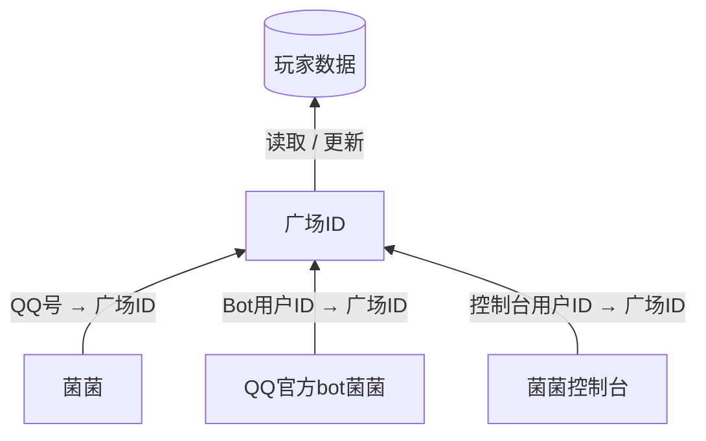

# 和鼓众广场连接
你可以通过菌菌将自己的QQ与鼓众广场绑定，以获取自己的游戏信息。
::: danger 注意
**在普通版菌菌上绑定之后，QQ官方Bot版菌菌需要重新绑定，因为QQ官方Bot没办法知道你的QQ号。**

但是保存下来的鼓众广场用户信息只有一份，在两个版本的菌菌中是互通的。
:::

::: details 关于上方注意事项的详细说明
就像上面说的那样，你也许会好奇搞得这么复杂，不会乱套吗？

其实是这样：广场玩家数据在菌菌的一整套系统里是单独保存的，而能获取QQ号的菌菌、不能获取QQ号的菌菌、菌菌控制台这些只保存了自身和广场玩家数据的绑定关系，本身并不存储玩家数据。它们任意一方都可以对玩家数据更新，更新了的数据也不需要其它的同步，毕竟数据只有这一份。

比如能获取QQ号的菌菌会建立`[QQ号 → 广场ID]`的绑定关系、菌菌控制台会建立`[用户ID → 广场ID]`的绑定关系，在菌菌里使用`/更新广场`对玩家数据更新后，在菌菌控制台中通过用户ID去查对应的玩家数据，拿到的就直接是更新后的数据了。

因此你也不需要反复更新，只要是菌菌的保存的数据，无论在哪都只需要更新一次。（其实冷却时间也是互通的（（

:::

## 绑定方法
发送“`/绑定广场` `广场小程序中的用户ID`”、或者“`/绑定广场` `广场网页中的太鼓番`”

然后按照菌菌的提示操作即可。

<Chatbox :messages="chatMessages" 
myAvatar='../avatar_neko.png' 
otherAvatar="../avatar_kinoko.png" />

::: tip 提示
修改的是你的**称号**，不是你的玩家名。
:::

## 更新广场信息
菌菌不是实时从游戏服务器读取你的成绩的。

菌菌需要从广场爬取你公开的成绩再保存下来。所以当你的成绩发生变化后，需要手动更新。发送`/更新广场`即可更新。
<Chatbox :messages="chatMessages2" 
myAvatar='../avatar_neko.png' 
otherAvatar="../avatar_kinoko.png" />

## 多账号处理
你可以在菌菌里绑定多个账号，使用`/常用账号`来切换各个功能使用的账号。对于`/更新广场`也可以在后面加上序号来更新指定用户。
<Chatbox :messages="chatMessages5" 
myAvatar='../avatar_neko.png' 
otherAvatar="../avatar_kinoko.png" />

::: details 如果你能用到非官方bot的菌菌，可以像这样妙用...
还记得开头说过的“在普通版菌菌上绑定之后，QQ官方Bot版菌菌需要重新绑定”吗？

你可以在两个菌菌上各绑定一个账号，这样就不需要用`/常用账号`来切换了。
:::

## 绑定了之后可以做什么？

### 解绑广场
发送`/解绑广场`来解除绑定。
如果你绑定了多个账号，发送这个将会解除**常用账号**的绑定，要确认好再解绑哦。

<Chatbox :messages="chatMessages6" 
myAvatar='../avatar_neko.png' 
otherAvatar="../avatar_kinoko.png" />

### 看小咚形象

发送`/我的小咚`试试吧！图片是透明底的，如果想用来做什么的话就省去你抠图的时间了
<Chatbox :messages="chatMessages3" 
myAvatar='../avatar_neko.png' 
otherAvatar="../avatar_kinoko.png" />

### 查分
发送`查分+关键词`或者`我<关键词>多少分`就可以用你输入的关键词查分了，和[别名查歌](../taiko/alia-search.md)的机制相同。

查询的难度是根据别名来的，如果没匹配到别名走模糊搜索的话，不指定难度默认发最高难度

<Chatbox :messages="chatMessages4" 
myAvatar='../avatar_neko.png' 
otherAvatar="../avatar_kinoko.png" />

> 中间的评价刻度尺中，预测达标各个评价的成绩所使用的连打秒速是按照你当前分数里的秒速计算的。
>
> 如果你的连打太少导致即时全良都不能达到“极”评价时，也会提醒你补几个连打

